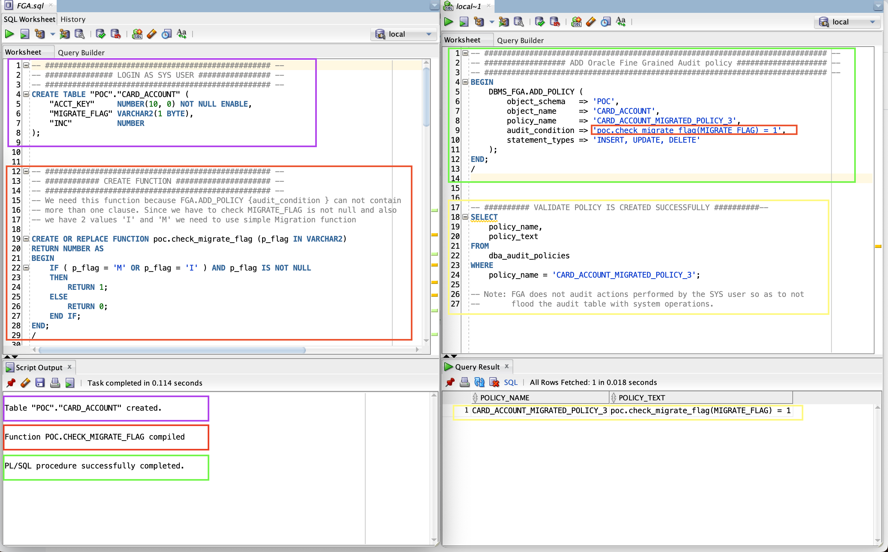
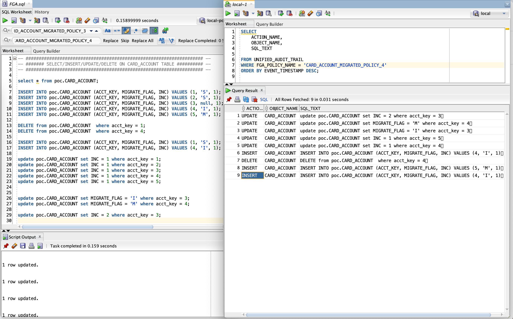

# Oracle Fine-Grained Auditing (FGA) 

Oracle Fine-Grained Auditing (FGA) (available in Enterprise Edition) is an in-built feature that enables granular, value-based monitoring of data access by creating policies that trigger audits based on specific SQL conditions.

**For example:**

You can set a AUDIT_POLICY say "In table_1 for records/rows with IND column value equals to `Y` and if anyone trys to updates this record then Audit". 

Now when an update is performed then the details will be audited in UNIFIED_AUDIT_TRAIL table

# Performance Test Results

1. 1000000 inserted | 400000 audited | 97.318 seconds | 86.412 seconds | 98.343 seconds (40% resulted in audit)
2. 1000000 inserted | NO ORA_FGA     | 5.978 seconds  | 6.487 seconds  | 6.815 seconds (FGA disabled)
3. 1000000 inserted | 0 audited      | 10.354 seconds | 10.51 seconds  | 10.187 seconds (FGA Enabled but zero audit)

