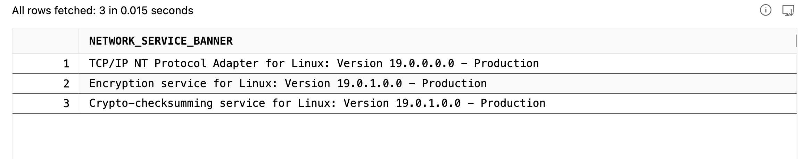
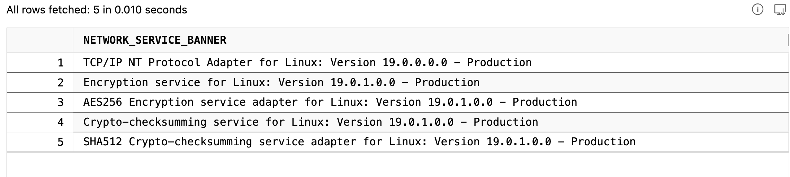

# Oracle Native Network Encryption (NNE) 

Oracle Native Network Encryption (NNE) is a a built-in security feature within Oracle Net Services that encrypts data in transit between clients and servers, preventing eavesdropping and tampering. Available in all editions (including SE and XE) since Oracle 12c, it enables encryption via `sqlnet.ora` without requiring costly advanced security licenses or complex certificate management.

**Note:** While NNE provides robust encryption, it does not provide the same level of authentication as SSL/TLS. Oracle themselves officially recommends TLS over NNE because it provides non-repudiation and stronger authentication.

## Enabling Oracle NNE on server 

Edit `sqlnet.ora` file and add the following properties to force use of AES256 Encryption algorithm and SHA512 crypto checksum

```txt
    # Force encryption
    SQLNET.ENCRYPTION_SERVER = REQUIRED
    SQLNET.ENCRYPTION_TYPES_SERVER = (AES256)

    # Force crypto checksumming (integrity)
    SQLNET.CRYPTO_CHECKSUM_SERVER = REQUIRED
    SQLNET.CRYPTO_CHECKSUM_TYPES_SERVER = (SHA512)

    # Optional hardening
    SQLNET.ALLOWED_LOGON_VERSION_SERVER = 12
    SQLNET.EXPIRE_TIME = 10
```

Restart the server for the properties to reflect 

## On Docker 
You will find `sqlnet.ora` file at following location:

```cmd
    /opt/oracle/product/19c/dbhome_1/network/admin/sqlnet.ora
```

login into docker container shell & edit the `sqlnet.ora` file to add above properties 

```cmd
    docker exec -it oracle19 bash
    vi $ORACLE_HOME/network/admin/sqlnet.ora

ESC 'i' -> insert
ESC :wq -> write and quit
```

To restart docker container 

```cmd
    docker restart oracle19
```

## Changes On Client End

Ideally Client doesnt need to make any change to start using NNE AES256 algorithm for encryption - since the Database server is set to REQUIRED- it enforces that we use NNE AES256-SHA512, as long as Client app supports this algorithm, it should connect with out any changes. 

But as a good practice and documentation puropose client app can update the DB connection url by appending the following at the end  `?oracle.net.encryption_client=REQUIRED&oracle.net.encryption_types_client=AES256&oracle.net.crypto_checksum_client=REQUIRED&oracle.net.crypto_checksum_types_client=SHA512`


## Check If we are using AES256-SHA512

```sql
    select DISTINCT NETWORK_SERVICE_BANNER from GV$SESSION_CONNECT_INFO
    where sid in (select distinct sid from GV$MYSTAT);
```

**Before:**


**After:**
