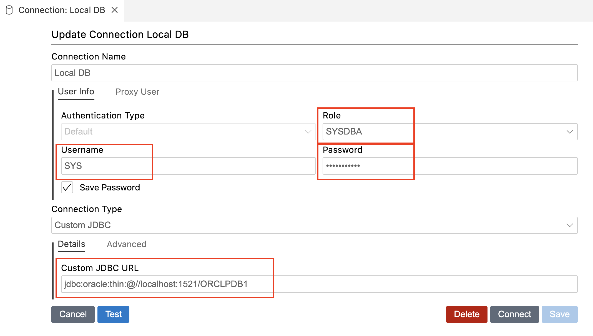

# Running Oracle 19c EE Database In MacOS Using Docker

## Step 1: 

Install Docker Desktop so we can build docker image and run newly build Oracle image in docker container.

```cmd
    brew install --cask docker
```

## Step 2: 

Clone `docker-images` git repo from Oracle gitHub. This repository contains Dockerfiles and samples to build Docker images for Oracle commercial products and Oracle sponsored open source projects.

```cmd
     git clone https://github.com/oracle/docker-images.git 
```

## Step 3:

Login into Oracle.com 

Download LINUX.ARM64_1919000_db_home.zip (ARM64 because I am using Macbook with M5 chip)
https://www.oracle.com/database/technologies/oracle19c-linux-arm64-downloads.html


## Step 4: 
copy the LINUX.ARM64_1919000_db_home.zip file into the git project to "docker-images/OracleDatabase/SingleInstance/dockerfiles/19.3.0/" location
**Note:** Do NOT unzip the LINUX.ARM64_1919000_db_home.zip file

## Step 5:
Open terminal at docker-images/OracleDatabase/SingleInstance/dockerfiles/ location

run the following command to build docker image 

```cmd
    ./buildContainerImage.sh -v 19.3.0 -e
```

<textarea rows="10" cols="70" style="overflow-y: scroll;">

Last login: Tue Feb  3 22:28:46
ravieragapati@Mac ~ % cd MyPOC 
ravieragapati@Mac ~ %
ravieragapati@Mac MyPOC % cd docker-images/OracleDatabase/SingleInstance/dockerfiles
ravieragapati@Mac MyPOC %
ravieragapati@Mac dockerfiles % ls
11.2.0.2		12.2.0.1		18.4.0			21.3.0			buildContainerImage.sh
12.1.0.2		18.3.0			19.3.0			23.26.0
ravieragapati@Mac dockerfiles %
ravieragapati@Mac dockerfiles %
ravieragapati@Mac dockerfiles % ./buildContainerImage.sh -v 19.3.0 -e
Checking Docker version.
Dockerfile
Checking if required packages are present and valid...
LINUX.ARM64_1919000_db_home.zip: OK
==========================
Container runtime info:
Client:
 Version:    29.2.0
 Context:    desktop-linux
 Debug Mode: false
 Plugins:
  ai: Docker AI Agent - Ask Gordon (Docker Inc.)
    Version:  v1.17.2
    Path:     /Users/ravieragapati/.docker/cli-plugins/docker-ai
  buildx: Docker Buildx (Docker Inc.)
    Version:  v0.31.1-desktop.1
    Path:     /Users/ravieragapati/.docker/cli-plugins/docker-buildx
  compose: Docker Compose (Docker Inc.)
    Version:  v5.0.2
    Path:     /Users/ravieragapati/.docker/cli-plugins/docker-compose
  debug: Get a shell into any image or container (Docker Inc.)
    Version:  0.0.47
    Path:     /Users/ravieragapati/.docker/cli-plugins/docker-debug
  desktop: Docker Desktop commands (Docker Inc.)
    Version:  v0.2.0
    Path:     /Users/ravieragapati/.docker/cli-plugins/docker-desktop
  extension: Manages Docker extensions (Docker Inc.)
    Version:  v0.2.31
    Path:     /Users/ravieragapati/.docker/cli-plugins/docker-extension
  init: Creates Docker-related starter files for your project (Docker Inc.)
    Version:  v1.4.0
    Path:     /Users/ravieragapati/.docker/cli-plugins/docker-init
  mcp: Docker MCP Plugin (Docker Inc.)
    Version:  v0.37.0
    Path:     /Users/ravieragapati/.docker/cli-plugins/docker-mcp
  model: Docker Model Runner (Docker Inc.)
    Version:  v1.0.8
    Path:     /Users/ravieragapati/.docker/cli-plugins/docker-model
  offload: Docker Offload (Docker Inc.)
    Version:  v0.5.41
    Path:     /Users/ravieragapati/.docker/cli-plugins/docker-offload
  pass: Docker Pass Secrets Manager Plugin (beta) (Docker Inc.)
    Version:  v0.0.24
    Path:     /Users/ravieragapati/.docker/cli-plugins/docker-pass
  sandbox: Docker Sandbox (Docker Inc.)
    Version:  v0.11.0
    Path:     /Users/ravieragapati/.docker/cli-plugins/docker-sandbox
  sbom: View the packaged-based Software Bill Of Materials (SBOM) for an image (Anchore Inc.)
    Version:  0.6.0
    Path:     /Users/ravieragapati/.docker/cli-plugins/docker-sbom
  scout: Docker Scout (Docker Inc.)
    Version:  v1.19.0
    Path:     /Users/ravieragapati/.docker/cli-plugins/docker-scout

Server:
 Containers: 0
  Running: 0
  Paused: 0
  Stopped: 0
 Images: 0
 Server Version: 29.2.0
 Storage Driver: overlayfs
  driver-type: io.containerd.snapshotter.v1
 Logging Driver: json-file
 Cgroup Driver: cgroupfs
 Cgroup Version: 2
 Plugins:
  Volume: local
  Network: bridge host ipvlan macvlan null overlay
  Log: awslogs fluentd gcplogs gelf journald json-file local splunk syslog
 CDI spec directories:
  /etc/cdi
  /var/run/cdi
 Swarm: inactive
 Runtimes: runc io.containerd.runc.v2
 Default Runtime: runc
 Init Binary: docker-init
 containerd version: dea7da592f5d1d2b7755e3a161be07f43fad8f75
 runc version: v1.3.4-0-gd6d73eb8
 init version: de40ad0
 Security Options:
  seccomp
   Profile: builtin
  cgroupns
 Kernel Version: 6.12.67-linuxkit
 Operating System: Docker Desktop
 OSType: linux
 Architecture: aarch64
 CPUs: 10
 Total Memory: 7.653GiB
 Name: docker-desktop
 ID: dc220915-c1d3-4588-9728-8c37fec12f2d
 Docker Root Dir: /var/lib/docker
 Debug Mode: false
 HTTP Proxy: http.docker.internal:3128
 HTTPS Proxy: http.docker.internal:3128
 No Proxy: hubproxy.docker.internal
 Labels:
  com.docker.desktop.address=unix:///Users/ravieragapati/Library/Containers/com.docker.docker/Data/docker-cli.sock
 Experimental: false
 Insecure Registries:
  hubproxy.docker.internal:5555
  ::1/128
  127.0.0.0/8
 Live Restore Enabled: false

==========================
Building image 'oracle/database:19.3.0-ee' ...
[+] Building 189.7s (15/15) FINISHED                                                               docker:desktop-linux
 => [internal] load build definition from Dockerfile                                                               0.0s
 => => transferring dockerfile: 5.12kB                                                                             0.0s
 => WARN: FromAsCasing: 'as' and 'FROM' keywords' casing do not match (line 25)                                    0.0s
 => [internal] load metadata for docker.io/library/oraclelinux:8                                                   4.2s
 => [internal] load .dockerignore                                                                                  0.0s
 => => transferring context: 2B                                                                                    0.0s
 => [base 1/4] FROM docker.io/library/oraclelinux:8@sha256:f3759153ce4cef654e67bf179b8dfdab460f2461069f4c1e08df9b  4.9s
 => => resolve docker.io/library/oraclelinux:8@sha256:f3759153ce4cef654e67bf179b8dfdab460f2461069f4c1e08df9b79b10  0.0s
 => => sha256:f7746540d69ea689934b73e1d70007e8e5be184547e6705477f2c5aacee9a1d5 99.90MB / 99.90MB                   3.2s
 => => extracting sha256:f7746540d69ea689934b73e1d70007e8e5be184547e6705477f2c5aacee9a1d5                          1.8s
 => [internal] load build context                                                                                 11.7s
 => => transferring context: 2.42GB                                                                               11.7s
 => [base 2/4] COPY setupLinuxEnv.sh checkSpace.sh /opt/install/                                                   0.3s
 => [base 3/4] COPY runOracle.sh startDB.sh createDB.sh createObserver.sh dbca.rsp.tmpl setPassword.sh checkDBSta  0.0s
 => [base 4/4] RUN chmod ug+x /opt/install/*.sh &&     sync &&     /opt/install/checkSpace.sh &&     /opt/instal  33.3s
 => [builder 1/2] COPY --chown=oracle:dba LINUX.ARM64_1919000_db_home.zip db_inst.rsp installDBBinaries.sh /opt/i  3.4s 
 => [builder 2/2] RUN chmod ug+x "/opt/install"/*.sh &&     sync &&     "/opt/install"/"installDBBinaries.sh" ee  46.5s 
 => [stage-2 1/4] COPY --chown=oracle:dba --from=builder /opt/oracle /opt/oracle                                   4.5s 
 => [stage-2 2/4] RUN "/opt/oracle"/oraInventory/orainstRoot.sh &&     "/opt/oracle/product/19c/dbhome_1"/root.sh  0.2s 
 => [stage-2 3/4] WORKDIR /home/oracle                                                                             0.0s 
 => [stage-2 4/4] RUN echo 'ORACLE_SID=${ORACLE_SID:-ORCLCDB}; export ORACLE_SID=${ORACLE_SID^^}' > .bashrc        0.1s 
 => exporting to image                                                                                            82.1s 
 => => exporting layers                                                                                           69.0s 
 => => exporting manifest sha256:a422b96a6f7989b70553955558cb72d86e95ac6fffc3ea2bfebe9ef4e0268959                  0.0s
 => => exporting config sha256:1fe71c8db7d5553ec707df59eab89dd6cecadd566158d01229b6afbeb796636d                    0.0s
 => => exporting attestation manifest sha256:981cf833363bd1d7287b5f44f9ea08c23615f2a49750c32fe97c96e66e10e8af      0.0s
 => => exporting manifest list sha256:093df79d0cb6d5ae3b3f473a98b3473d440ffae88ea4d1b3670657e8f9681fe2             0.0s
 => => naming to docker.io/oracle/database:19.3.0-ee                                                               0.0s
 => => unpacking to docker.io/oracle/database:19.3.0-ee                                                           13.0s

 1 warning found (use docker --debug to expand):
 - FromAsCasing: 'as' and 'FROM' keywords' casing do not match (line 25)


  Oracle Database container image for 'ee' version 19.3.0 is ready to be extended: 
    
    --> oracle/database:19.3.0-ee

  Build completed in 191 seconds.
  
ravieragapati@Mac dockerfiles % 

</textarea>


## Step 6

Verify that image is create using below docker command


```cmd
    docker images
```

**Output:** 
```txt
    IMAGE                       ID             DISK USAGE   CONTENT SIZE   EXTRA
    oracle/database:19.3.0-ee   093df79d0cb6       8.75GB         3.02GB    U   
```

## Step 7
Now that the image is successfully create and avaialbe, execute the bellow command to run the docker image 

```cmd
    docker run -d --name oracle19 -e ORACLE_PWD=<MyPassword1> -p 1521:1521 oracle/database:19.3.0-ee
```

If you have Docker Desktop you can navigate to Docker Desktop > Container tab > click on the container that being launched and look at container logs 

You should take note of the following Database Info:
Database Information:

``` log
Global Database Name:ORCLCDB
System Identifier(SID):ORCLCDB
Creating Pluggable Databases
#########################
DATABASE IS READY TO USE!
#########################
And some audit log trail showing the name of pluggable Database that gets created 

ALTER PLUGGABLE DATABASE ORCLPDB1 SAVE STATE

```

## Step 8 
Congradulations your Oracle DB is up and running inside a docker container 

If you are using VSCode then you should be able to install a `Oracle SQL Developer Extension for VSCode` plugin avilable at : https://marketplace.visualstudio.com/items?itemName=Oracle.sql-developer



## Step 9 
Login as SYS user with SYSDBA role and create a new user to use with your application 

```sql
-- Create the user
CREATE USER app_user IDENTIFIED BY "<MyPassword1>";

-- Grant basic connection and resource usage
GRANT CONNECT, RESOURCE TO app_user;

-- Grant quota on your default tablespace so the user can actually store data
ALTER USER app_user QUOTA UNLIMITED ON USERS;

-- Grant app_user DBA role for POC purpose only - always follow Principle of Least Privilege (PoLP) otherwise.
GRANT DBA TO app_user;

```

## Step 10 
JDBC Thin URL: `jdbc:oracle:thin:@//localhost:1521/ORCLPDB1`